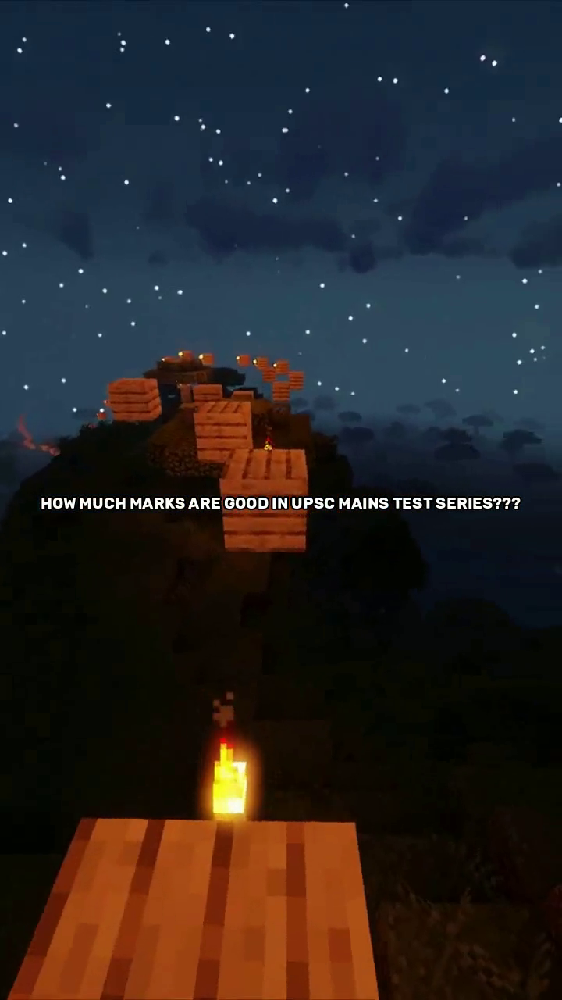

# 📖 Reddit Story to Video Generator

Turn Reddit posts into engaging videos with automatic text-to-speech conversion and video generation! 🎥🚀


## ✨ Features

- 🔍 **Fetch Reddit Stories**: Automatically fetch stories from Reddit using a post URL.
- 🗣 **Text-to-Speech**: Convert the post title and body into audio using high-quality voice models.
- 🎬 **Video Creation**: Generate videos with synchronized captions from the Reddit story.
- 🎨 **Custom Styling**: Adjust captions, fonts, and styles to make each video unique.
- 🎶 **Background Music**: Add audio to create a fully-voiced video output.

## 📋 Prerequisites

- **Python 3.8+**: Make sure Python is installed.
- **FFmpeg**: Install FFmpeg to process audio and video.

## 🛠 Installation

1. Clone the repository:

   ```bash
   git clone https://github.com/your-username/reddit-story-to-video.git
   cd reddit-story-to-video
   ```

2. Install the dependencies:

   ```bash
   pip install -r requirements.txt
   ```

3. Set up your `.env` file with your API keys:

   ```env
   REDDIT_CLIENT_ID=your_client_id
   REDDIT_CLIENT_SECRET=your_client_secret
   ELEVENLABS_API_KEY=your_elevenlabs_api_key
   ```

## 🚀 Usage

1. Run the script:

   ```bash
   python reddit_video_generator.py
   ```

2. Enter the Reddit post URL when prompted:

   ```
   Enter the Reddit post URL: https://www.reddit.com/r/...
   ```

3. Watch as the script fetches the post, converts the text into speech, generates a video, and combines it with the audio.

4. Find your generated video in the `output/` directory! 🎉

## 📂 Directory Structure

```
reddit-story-to-video/
├── video/                # Sample video clips for background
├── font/                 # Custom fonts for captions
├── frames/               # Temporary directory for frames
├── output/               # Final video output directory
├── images/               # Images for the README
├── .env                  # Store API keys here
├── reddit_video_generator.py  # Main script
├── requirements.txt      # Python dependencies
└── README.md             # Project documentation
```

## 📸 Screenshots

###Here's an example of how the output might look:


*Example of the generated video thumbnail.*


*A frame from the video showing a caption extracted from the Reddit post.*

## 🎥 Video Output Example

Check out a sample video generated using this tool:

https://user-images.githubusercontent.com/your-username/sample_video.mp4

> **Note**: Replace `your-username` with your GitHub username and add the link to the video hosted on your GitHub or a video-sharing platform.

## 🧰 Built With

- **Python** 🐍
- **PRAW** for Reddit API integration
- **MoviePy** for video editing
- **PIL/Pillow** for image manipulation
- **OpenCV** for frame extraction and processing

## 🌟 Contributing

Feel free to fork this project, create a new branch, and submit a pull request. Contributions are always welcome! 😊

## 📄 License

This project is licensed under the MIT License - see the [LICENSE](LICENSE) file for details.

## 🙏 Acknowledgements

- Reddit API for providing access to Reddit posts.
- ElevenLabs for the high-quality text-to-speech services.

## Contact

If you have any questions or suggestions, feel free to reach out at <a href="https://www.instagram.com/deepanshutomarg">Instagram</a>.
